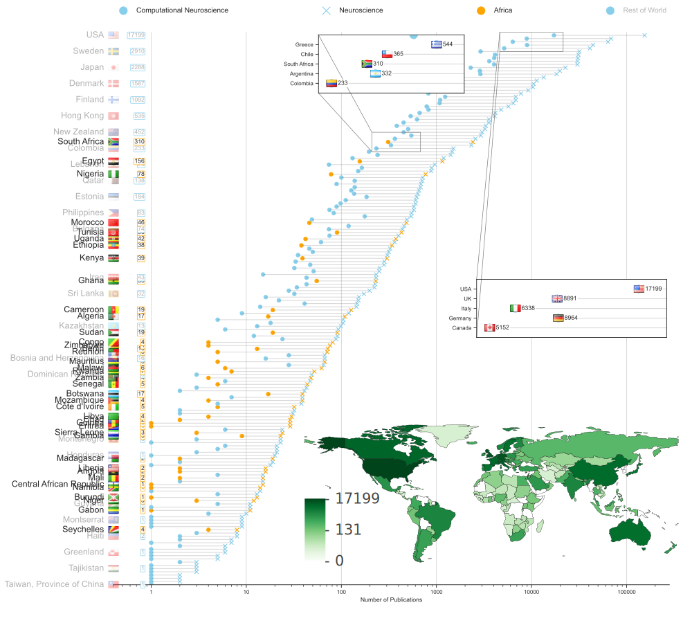

# Computational Neuroscience publications by country*

*according to PubMed

## Code for figure 1 in paper [Think: Theory for Africa](https://journals.plos.org/ploscompbiol/article?id=10.1371/journal.pcbi.1007049) in PLoS Computational Biology


> **Figure 1: African contributions to neuroscience and computational neuroscience research.**

> Countries are ranked according to the number of neuroscience publications (crosses) generated and indexed on PubMed. The number of computational neuroscience publications produced by each country are indicated by circles. Most contributing African countries (orange, black text) and a subset of global countries (blue, grey text) are labelled on the left.
Some African countries (e.g. Ethiopia) have little-to-no computational neuroscience output despite notable neuroscience output. These countries have the potential to leverage existing neuroscience infrastructures for developing computational neuroscience expertise. Inset, a world map of computational neuroscience publications produced per country represented as a heat map, highlights the disparity between African nations and the rest of the world. The data was collected through structured searches on PubMed for authors who have been involved in a computational, mathematical, or theoretical neuroscience paper.

All the code is in `comp_neuro_viz.ipynb`

Icons for countries are in the `famfamfam_flag_icons` folder

Figures are committed in the repo too

## Setup

### Optional (install and setup environment in Conda)

1. Install [Anaconda](https://www.anaconda.com/distribution/#download-section)

2. Create a new environment with the required packages

    ```bash
    conda create -n comp_neuro_viz python jupyterlab
    conda activate comp_neuro_viz
    ```

3. Add the environment to Jupyter

    ```bash
    python -m ipykernel install --user --name comp_neuro_viz --display-name "Python (comp_neuro_viz)"
    ```

### Install the required packages

```bash
pip install -r requirements.txt
```
